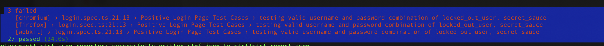

# Task 2 - Test Automation: UI Tests for Sprite Cloud Assignment

This project is a test automation solution for the Sprite Cloud assignment, focused on UI tests using 
[Playwright](https://playwright.dev).

## Why Playwright

> 
The origins of Playwright come from Puppeteer, a tool that I will be getting into next, and it makes use of many of the same API methods to interact with browsers and operate. Like Cypress, it is also a node.JS-based tool and therefore can also interact with elements of the site itself, rather than just purely acting as a client against the browser. It also operates on a WebSocket protocol as opposed to a traditional HTTP protocol that traditional tools like Selenium have used in the past. 

The biggest differentiating point of Playwright is its cross-browser compatibility. It can drive Chromium, WebKit (the browser engine for Safari), and Firefox. Along with this, starting a new library allowed Playwright to improve ergonomics in ways that would break Puppeteer. For example, Playwright’s page.click waits for an element to be visible by default....
>
[see more here](https://www.linkedin.com/pulse/pros-cons-different-ui-automation-test-tools-playwright-craig-risi/)

---


## Solution Overview

- **Tool**: Playwright  
- **Language**: Typescript  

This solution provides a framework for UI test automation, including:
- Automated **positive and negative tests** for the login page.
- **Page Object Model (POM) structure** created specifically for the login page.
- Test coverage implemented using Playwright.

### Notes:
### POINTS to discuss
1. During testing, it was observed that one of the accessible values in the tuple used for positive test cases did not work as expected. This issue has been documented and requires further investigation.


---

## Installation and Setup

### 1. Installing Playwright
Run the following command to initialize Playwright:  

```bash
npm init playwright@latest
```

### 2. Installation Test Report

```bash
npm install --save-dev playwright-ctrf-json-reporter
```

Add the reporter to your playwright.config.ts file:

```
reporter: [
  ['list'], // You can combine multiple reporters
  ['playwright-ctrf-json-reporter', {}]
],
```

---

## Running the Tests

### Run All Tests
To execute all tests for (3 browsers), use the next command:  

```bash
npx playwright test
```

---

## Test Reporting

### HTML Test Reports
1. Test report are located in the `playwright-report` directory of the project. (In case of local setup)
To view the HTML report, run in CLI:  

   ```bash
   npx playwright show-report
   ```
2. GitHub Actions report:
- ctrf report is attached as the **test summary** 
- html report is attached as the **Artifacts** 

### GitHub Actions Workflow
- Test execution results can also be found in the GitHub Actions workflow page:  
  [GitHub Workflow Page](https://github.com/Injeevskaya/SpriteCloudUI/actions/workflows/playwright.yml)

---