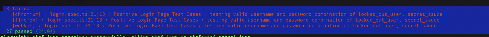

# Task 2 - Test Automation: UI Tests for Sprite Cloud Assignment

This project is a test automation solution for the Sprite Cloud assignment, focused on UI tests using [Playwright](https://playwright.dev).

---

## Requirements

### Test Cases
- Write **3 UI web tests**.

### Rules
- Tests are executed on: [SauceDemo](https://www.saucedemo.com).

### Deliverables
- A clear `README.md` file for the automation solution.

### Technology Stack
- **Tool**: Playwright  
- **Language**: Typescript  
  > Restriction: No "Record and Play" tools allowed.

---

## Solution Overview

- **Tool**: Playwright  
- **Language**: Typescript  

This solution provides a framework for UI test automation, including:
- Automated **positive and negative tests** for the login page.
- A **Page Object Model (POM) structure** created specifically for the login page.
- Test coverage implemented using Playwright.

> **Note:** During testing, it was observed that one of the accessible values in the tuple used for positive test cases did not work as expected. This issue has been documented and requires further investigation.


---


## Installation and Setup

### 1. Installing Playwright
Run the following command to initialize Playwright:  

```bash
npm init playwright@latest
```

---

## Running the Tests

### Run All Tests
To execute all tests, use:  

```bash
npx playwright test
```

---

## Test Reporting

### HTML Test Reports
1. Test reports are located in the `playwright-report` directory of the project.
2. To view the HTML report, run:  

   ```bash
   npx playwright show-report
   ```

### GitHub Actions Workflow
- Test execution results can also be found in the GitHub Actions workflow page:  
  [GitHub Workflow Page](https://github.com/Injeevskaya/SpriteCloudUI/actions/workflows/playwright.yml)

---

## What is CTRF?

**CTRF** (Common Test Reporting Format) is a universal JSON test report schema designed to address the lack of a standardized format for JSON test reports.  

---